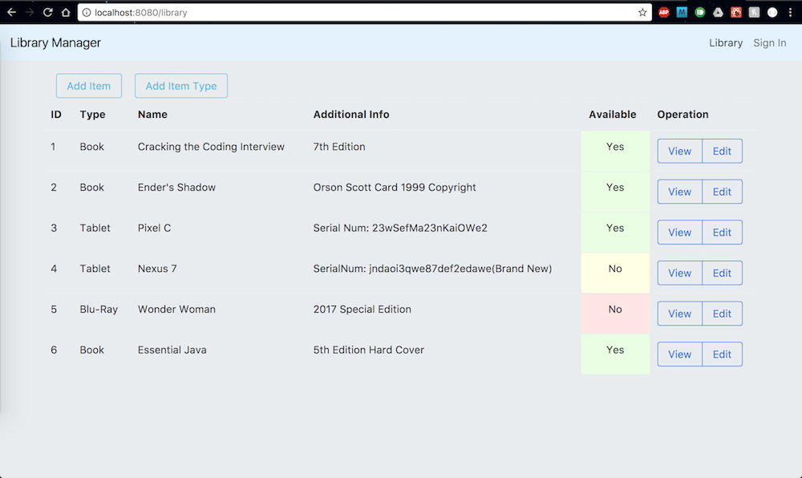
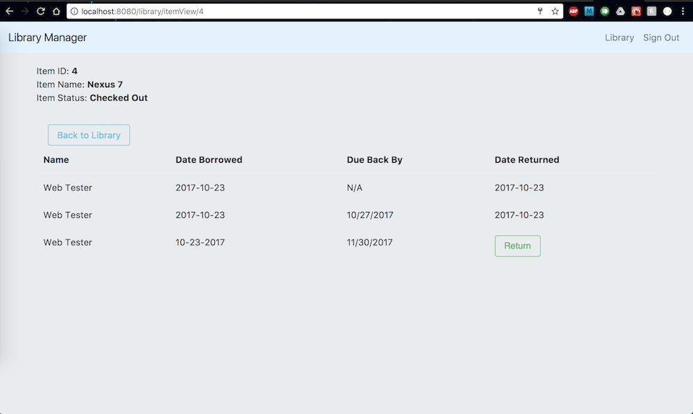

# Library Management Project

## Project Description
This is an application that will allow an administrator to manage
their library by keeping track of what is borrowed, who borrowed it,
and when they borrow it. Additionally it will keep track when
the items are returned.





## Project Stack

### Front-End
* ReactJS v 15
* ReactRedux
* Redux
* React-Router v 4
* Basic Front-End Authentication through a custom Higher Order Component

### Back-End
* Node Express Server
* MySQL
* Local and and JSON Web Token Authentication with Passport

## How To Run

### Clone the repo
Checkout this repo and install the dependencies

```
> git clone https://github.com/arendon13/LibraryManagement.git
> npm install
```


### Database Setup
Setting up the Database can be done by running the LibraryManagement.sql on a MySQL Server.
A customer config.js file will need to be set up and placed in the Server Directory. This file contains database credentials and the "secret" key for creating a JSON Web Token. You can use the following as a guideline:
```
exports.database = {
  host: <Your Host>,
  user: <Your User>,
  password: <Your Password>,
  database: 'library_management',
  multipleStatements: true
};


exports.auth = {
  secret: <Your Secret Key>
}

```

### Back-End Server
Navigate to Server Directory and run the following command:
```
> npm run dev
```

### Front-End
Navigate to Library Directory and run the following command:
```
> npm run start
```
